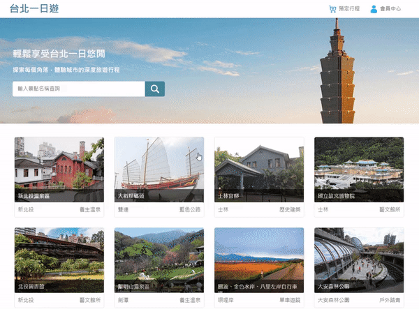

# [Taipei-day-trip](http://54.184.227.131:3000/)
Taipei-day-trip is an e-commerce website, that allows users to explore and book a one-day trip in Taipei city.

This is my first project in the [WeHelp Bootcamp](https://wehelp.tw/). It is built with Vanilla Javascript and Flask, and designed according to this [figma prototype](https://www.figma.com/file/MZkYBH31H5gyLoZoZq116j) and [API documentation](https://app.swaggerhub.com/apis-docs/padax/taipei-day-trip/1.1.0).

🖥️ Website URL : http://54.184.227.131:3000/

✏ Test account and password :
|    account    | password |
|:-------------:|:--------:|
| test@test.com | test1234 |

💳Test payment :
| Credit Card Number  | Expiry Date | CVV |
|:-------------------:|:-----------:|:---:|
| 4242 4242 4242 4242 |    02 / 34    | 123 |

## Demo
* Browsing attractions for one-day tours.

* Select and reserve a tour.

* Complete your purchase with [TapPay](https://www.tappaysdk.com/) online payment system & track your order history.

## Table of Contents 
- [Main Features](#main-features)
- [Database Schema](#database-schema)
- [Backend Technique](#backend-technique)
    - [Environment](#environment)
    - [Database](#database)
    - [AWS Cloud Service](#aws-cloud-service)
    - [Authentication](#authentication)
    - [Version Control](#version-control)
- [Frontend Technique](#frontend-technique)
- [Figma Prototype](#figma-prototype)
- [API Doc](#api-doc)
- [Contact](#contact)

## Main Features
* Member system with login and signup functions.
* User authentication is achieved with Json Web Token.
* Ability to search for attractions by related keyword.
* Infinite scroll down loading.
* Tours image carousel for easy browsing of tour photos.
* Shopping cart system for convenient booking of tours.
* Online payment system with [TapPay](https://www.tappaysdk.com/) for secure transactions.
* Ability for users to review their order history.
* Responsive web design for optimal viewing experience across devices.

## Database Schema

## Backend Technique

#### Environment
* Python / Flask

#### Database
* MySQL

#### AWS Cloud Service
* EC2

#### Authentication
* Bcrypt
* JSON Web Token (JWT)

#### Version Control
* Git / GitHub

## Frontend Technique
* HTML
* CSS
* JavaScript
* AJAX

## Figma Prototype
[Figma Prototype](https://www.figma.com/file/MZkYBH31H5gyLoZoZq116j)

## API Doc
[API Doc]((https://app.swaggerhub.com/apis-docs/padax/taipei-day-trip/1.1.0))

## Contact
🍭 盧佩瑩 Pei Ying Lu
📧 Email : peggy2000000@gmail.com
